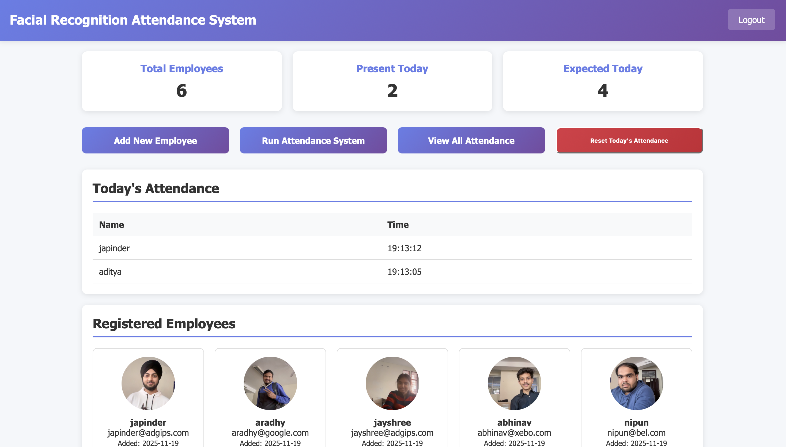
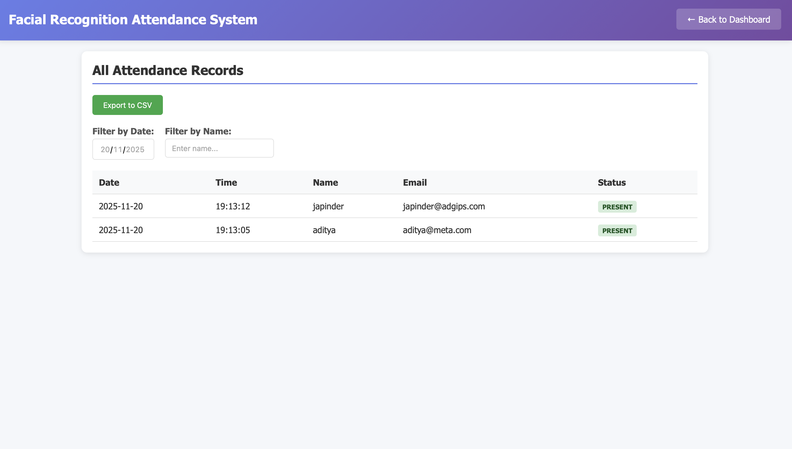

# 👤📸 Facial Recognition Attendance System

A smart **AI-powered attendance system** that uses **facial recognition** instead of manual registers or ID cards.  
This project captures a person’s face using a webcam, detects and recognizes the individual using machine learning models, and marks attendance automatically in a database.

---

## ⭐ Features

### 🔍 Face Detection
- Detects faces through a live webcam feed  
- Uses Haar Cascade or DLib face detection models  

### 🧠 Face Recognition
- Identifies registered individuals  
- Uses deep learning encodings  
- Works with real-time video  

### 📝 Attendance Marking
- Automatically logs:
  - Name  
  - Date  
  - Time  
- Avoids duplicate entries in a day  

### 👤 User Registration
- Allows adding new students/employees  
- Stores face encodings in a database/directory  

### 💾 Database Support
- CSV / Excel  
- SQLite / MySQL  

### 🖥️ Admin Dashboard
- View attendance history  
- View registered users  

---

## 📸 Screenshots

> Add real screenshots in the `/screenshots` folder.

### Home  


### Face Detection  


### Recognition  


### Attendance  


---

## 🧠 Technologies Used

### Core  
- Python  
- OpenCV  
- face_recognition  
- NumPy  

### Database  
- CSV / Excel / SQLite / MySQL  

---

## 📦 Project Structure

```
Facial-Recognition-Attendance/
│── images/
│── screenshots/
│── encodings/
│── models/
│── main.py
│── register.py
│── attendance.csv
│── requirements.txt
│── README.md
└── ...
```

---

## ⚙️ Installation & Setup

### Clone Repository
```bash
git clone https://github.com/adityabansal13/Facial-Recognition-Attendance
cd Facial-Recognition-Attendance
```

### Create Virtual Environment
```bash
python -m venv venv
source venv/bin/activate   # Mac/Linux
venv\Scripts\activate    # Windows
```

### Install Dependencies
```bash
pip install -r requirements.txt
```

### Run Main App
```bash
python main.py
```

---

## 🧪 Register New Faces

```bash
python register.py
```

---

## 🔍 How It Works

1. Load stored face encodings  
2. Capture webcam feed  
3. Detect faces using ML model  
4. Compute encodings from live frame  
5. Compare with stored encodings  
6. Mark attendance  

---

## 🧩 Future Improvements

- Cloud attendance storage  
- Mobile app integration  
- Face mask detection  
- Anti-spoofing (liveness detection)  
- Exportable reports  

---

## 🤝 Contributing

Pull requests and issues are welcome!

---

## 📄 License
MIT License

---

## 👨‍💻 Author
**Aditya Bansal**
